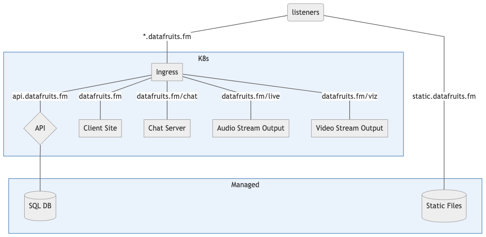
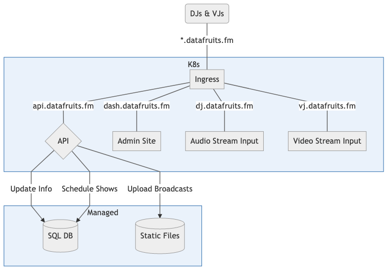

- Start Date: 2020-07-25
- RFC PR:

# Codify Infrastructure

<!-- toc -->

- [Summary 📖](#summary-%F0%9F%93%96)
- [Motivation 🏃🏻‍♀️](#motivation-%F0%9F%8F%83%F0%9F%8F%BB%E2%80%8D%E2%99%80%EF%B8%8F)
- [Detailed design 🔎](#detailed-design-%F0%9F%94%8E)
  * [What exactly _is_ the datafruits stack? 🤔](#what-exactly-_is_-the-datafruits-stack-%F0%9F%A4%94)
    + [Client Site (datafruits.fm) 🍉](#client-site-datafruitsfm-%F0%9F%8D%89)
    + [Admin Site (streampusher.com) 🚂](#admin-site-streampushercom-%F0%9F%9A%82)
    + [Static Assets 🗂](#static-assets-%F0%9F%97%82)
    + [Podcasts 🎙](#podcasts-%F0%9F%8E%99)
    + [Database 🛢](#database-%F0%9F%9B%A2)
    + [API 🚏](#api-%F0%9F%9A%8F)
    + [Audio streaming 🔊](#audio-streaming-%F0%9F%94%8A)
    + [Video Streaming 📹](#video-streaming-%F0%9F%93%B9)
    + [Chat 💬](#chat-%F0%9F%92%AC)
  * [Intro to Kubernetes ☁️](#intro-to-kubernetes-%E2%98%81%EF%B8%8F)
    + [Containers 📦](#containers-%F0%9F%93%A6)
      - [What's a container? 🧐](#whats-a-container-%F0%9F%A7%90)
      - [How do I make one? 🛠](#how-do-i-make-one-%F0%9F%9B%A0)
      - [Why should I make one? 🤷🏻‍♀️](#why-should-i-make-one-%F0%9F%A4%B7%F0%9F%8F%BB%E2%80%8D%E2%99%80%EF%B8%8F)
    + [Pods 🐟](#pods-%F0%9F%90%9F)
    + [Services 🚃](#services-%F0%9F%9A%83)
    + [Ingress 🚪](#ingress-%F0%9F%9A%AA)
    + [Nodes 🧱](#nodes-%F0%9F%A7%B1)
  * [Proposed Cluster Architecture 🏗](#proposed-cluster-architecture-%F0%9F%8F%97)
    + [Listeners (fruitcakes) 🎧](#listeners-fruitcakes-%F0%9F%8E%A7)
    + [DJs and VJs 💽](#djs-and-vjs-%F0%9F%92%BD)
    + [Developers 👩🏻‍💻](#developers-%F0%9F%91%A9%F0%9F%8F%BB%E2%80%8D%F0%9F%92%BB)
    + [Management 🤵🏻](#management-%F0%9F%A4%B5%F0%9F%8F%BB)
  * [Path to Production 👷🏻‍♀️](#path-to-production-%F0%9F%91%B7%F0%9F%8F%BB%E2%80%8D%E2%99%80%EF%B8%8F)
- [Drawbacks 😬](#drawbacks-%F0%9F%98%AC)
- [Alternatives ⚖️](#alternatives-%E2%9A%96%EF%B8%8F)
- [Unresolved questions ❓](#unresolved-questions-%E2%9D%93)

<!-- tocstop -->

## Summary 📖

Right now, the infrastructure for datafruits is really ad-hoc. As best as I can tell, some stuff is running on [Heroku](https://www.heroku.com/) and some stuff is running on [DigitalOcean](https://www.digitalocean.com/). This RFC has two goals:

1. Codify the infrastructure for the datafruits site so that it's easily understandable where everything lives.
2. Cloud-ify the existing infrastructure so that each component is individually scalable.

## Motivation 🏃🏻‍♀️

As stated above, one reason to do this is to make it more clear where everything lives -- it allows someone (like me ☺️) to take a look and understand how all the pieces fit together.

Another reason to keep the infrastructure as code is that it makes the infra versionable, meaning rollbacks are literally as easy as `git revert`. [More on the benefits of IoC](https://docs.microsoft.com/en-us/azure/devops/learn/what-is-infrastructure-as-code)

This also allows us to move from treating the services (streampusher, datafruits) like pets to treating them like cattle, which means less messy ssh-ing and more codified changes. [More reading on this terminology](https://medium.com/@Joachim8675309/devops-concepts-pets-vs-cattle-2380b5aab313)

Additionally, by moving to a [Kubernetes (K8s)](https://kubernetes.io/) based infrastructure, it allows us a lot more (horizontal) scalability, and the ability to scale out each chunk of the stack individually -- if there are 30,000,000 users in the chat, it makes sense to scale up the chat server, but maybe not also the [rmtp(s)](https://en.wikipedia.org/wiki/Real-Time_Messaging_Protocol) server, which only has the one person running viz connected to it.

Fourth, we now have the opportunity to actually do logging. Logging! Imagine, datafruits goes down and we don't have to spend eight hours figuring out why. We have an idea for a new feature, and we can actually figure out if people use it. Metrics! God, the metrics. Plus we can avoid G\*\*\*\*\* A\*\*\*\*\*\*\*\* and run our [own analytics platform](https://github.com/zgoat/goatcounter) that's privacy friendly.

Lastly, there are also cost savings associated with moving to a containerized architecture. We move from running a few digital ocean droplets, a couple heroku dynos, and whatever else we have to running 3 droplets on digital ocean. Additionally, those droplets will be a lot more efficient about their resource usage than they currently are, since their only purpose will be to run docker images.

## Detailed design 🔎

I wrote this out in the order that makes sense to me, but feel free to skip around. I'll go over my understanding of what comprises the "datafruits stack", a brief overview of just the critical things you need to understand Kubernetes ("just enough to be dangerous"), a look at how I think we should structure the infrastructure both inside and outside the cluster, and a gradual adoption plan to transition datafruits over to the new ecosystem.

### What exactly _is_ the datafruits stack? 🤔

Basically, to run on kubernetes, you need to make all of your applications (like, code that executes and runs things) [containerizable](https://opensource.com/resources/what-docker), and you need to keep your data elsewhere. We'll get into why this is the case later, but for now I'll go into these talking about the current way datafruits runs things and how we'll fit them into the new model.

As near as I can tell, this is an overview of the entire tech stack that goes into making datafruits tick. I'm suuuuper shaky on this, so feedback is highly appreciated -- I'm almost certainly missing things 🙃

#### Client Site (datafruits.fm) 🍉

The most important (arguably) part of the whole thing is the website. The repo lives at [datafruits/datafruits](https://github.com/datafruits/datafruits). It's built on [ember.js](https://emberjs.com/), and importantly with [ember-cli-fastboot](https://github.com/ember-fastboot/ember-cli-fastboot). This means that the web server is a [super lightweight Node.js process](https://github.com/ember-fastboot/fastboot-app-server#ember-fastboot-app-server), which is trivial to containerize. More on containerization later.

#### Admin Site (streampusher.com) 🚂

This is the place you go where if you're Tony, you can look at all the DJs and their information, or if you're a DJ you can manage your own stuff and upload sets and things like that. I'm not _super_ sure how it works, because I'm not a DJ and I don't have access to it, and I've never been invested enough to really dig through the code.

That said, it has its entire own codebase, which lives in [streampusher/frontend](https://github.com/streampusher/frontend). This, too, is an Ember app, which does NOT use ember-cli-fastboot. It currently lives on [netlify](https://www.netlify.com/), which is like a [serverless](https://aws.amazon.com/serverless/) [static site](https://en.wikipedia.org/wiki/Static_web_page) hosting platform, kind of like [GitHub Pages](https://pages.github.com/). I think. I've never used netlify, although I certainly have seen people sing its praises.

At least, I think it lives on netfliy. There's a netlify config in the [`ember-cli-build.js`](https://github.com/streampusher/frontend/blob/master/ember-cli-build.js). Either way, it should be similarly easy to containerize this app the same way we'd containerize the client site.

#### Static Assets 🗂

Another important thing for UX is the static assets -- who doesn't love the pulsating 𝕕𝕒𝕥𝕒𝕗𝕣𝕦𝕚𝕥𝕤 logo? Currently...I'm not sure how these are served. Some of them are checked in to the client site repo, but some of them aren't. With this RFC, I propose we move all of the static assets to dedicated object hosting (like [DigitalOcean Spaces](https://www.digitalocean.com/products/spaces/)). [More on object storage](https://blog.westerndigital.com/why-object-storage/)

We could minimize the pain of uploading assets separately and harcoding urls by editing the config for [`broccoli-asset-rev`](https://github.com/rickharrison/broccoli-asset-rev) (the tooling ember uses to process static assets) to prepend a url to the assets in production, and then just check everything in to the client site repo under `public/assets/`.

The coding for this _should_ be pretty easy, and would just involve adding something like the following to `ember-cli-build.js`:

```js
/* eslint-env node */
"use strict";
const EmberApp = require("ember-cli/lib/broccoli/ember-app");

module.exports = function (defaults) {
  let app = new EmberApp(defaults, {
    fingerprint: {
      prepend: app.env === "production" ? "https://static.datafruits.fm/" : "",
    },
    // more config...
  });

  //...
  return app.toTree();
};
```

..and then adding something to CI to upload any static assets we want that aren't served by fastboot to our object storage.

Note: It's worth looking into how fastboot handles assets, because some things (css, fonts?) are rendered server-side, but some things probably aren't. Either way, all the assets should live in one place. C'mon, now.

#### Podcasts 🎙

The podcasts, past broadcasts, and all that audio has to live somewhere. We could use a very similar (or even the same!) type of object storage to keep these handy. DigitalOcean Spaces is [S3](https://aws.amazon.com/s3/) compatible, meaning we could use existing tooling to manage all of thise stuff. Plus the pricing [isn't bad](https://www.digitalocean.com/pricing/#spaces-object-storage).

Realistically, what we do is when a new podcast is uploaded we add a row to our SQL database (more on that in the next paragraph) that contains the link to the object so we can keep track of them all in an organized way. That additional overhead is pretty much the reason I'm listing these as separate from static assets like JS, CSS, etc.

#### Database 🛢

Currently, datafruits is running [PostgreSQL](https://www.postgresql.org/), a variant of [SQL](https://www.infoworld.com/article/3219795/what-is-sql-the-first-language-of-data-analysis.html) ([more on relational vs. non-relational databases](https://www.pluralsight.com/blog/software-development/relational-non-relational-databases)). Cool. It's basically just a managed SQL database, meaning we don't have to worry about [scaling](https://www.freecodecamp.org/news/understanding-database-scaling-patterns/), [sharding](https://blog.yugabyte.com/how-data-sharding-works-in-a-distributed-sql-database/), or any of the other hassle that comes with standing up your own SQL instances in the cloud. This is going to live _outside_ of our Kubernetes cluster, so it's wonderful that it's already handled for us.

This database probably contains things like which DJs there are, what the links are to the podcasts, and that sort of thing. Basically, any persistent data involved with datafruits. There should be literally no change in this when we migrate to Kubernetes. I am not a database administrator, nor do I want to be. That sounds like hell.

#### API 🚏

You can't just write SQL queries in the frontend, because that's [gross and also a huge security vulnerability](https://stackoverflow.com/a/60332563). So you need a layer in between, where the datafruits website can go "hey show me all the podcasts tagged "house"" and then the API (the layer in between) can turn around and go `SELECT * FROM podcasts WHERE tags INCLUDES "house"` and then go "hey datafruits dot fm client site, here is the information you wanted".

Currently, the API lives in [streampusher/api](https://github.com/streampusher/api) ([look, here are the model classes](https://github.com/streampusher/api/tree/master/app/models)) and is written in [Ruby](https://www.ruby-lang.org/en/). The API is what's called [RESTful](https://restfulapi.net/), which means that it supports operations like `GET`, which retrieves data, `POST`, which creates new data, `PUT`, which is like `POST` but also updates data, `DELETE`, which is exactly what it sounds like, and `PATCH` which is like `PUT` but semantically different.

REST is pretty good, and certainly better than [SOAP](https://restfulapi.net/soap-vs-rest-apis/), but it has this issue where every particular type of data needs its own endpoint. This means you wind up getting super long and specific URLs like `api.datafruits.fm/artists/ovenrake/podcasts`. It also means that it's hard to change existing endpoints -- like if you wanted to restructure to `api.datafruits.fm/podcasts?dj=ovenrake`, then you'd have to deprecate the old endpoint, update all of your client code, yadda yadda yadda.

Another issue with REST is that it always returns all of the data it has. Even if all you want is the `title` and `link` to a podcast, you'll also get the `tags` and the `image` and the `bandcamp_link` or whatever other fields it has.

The solution to this is the new shiny thing called [GraphQL](https://graphql.org/), which aims to solve the problems that REST has. Refactoring the existing API into GraphQL is gonna probably warrant its own RFC, but I wanted to mention it here so I didn't forget about it.

In terms of containerization, the API literally [already has a Dockerfile](https://github.com/streampusher/api/blob/master/Dockerfile) so this should be ok with only minor tweaks.

#### Audio streaming 🔊

This is probably the second most important part of the ᴅᴀᴛᴀғʀᴜɪᴛs ᴇxᴘᴇʀɪᴇɴᴄᴇ, behind the site itself. The code that handles this stuff lives in [streampusher/radio](https://github.com/streampusher/radio). The audio streaming is built on [icecast](https://icecast.org), which is what broadcasts the audio, and [liquidsoap](https://www.liquidsoap.info/), which provides icecast with the audio to stream.

There's something to be said about rebuilding this setup to be less fragile, and there will likely be some issues trying to move this into Kubernetes. Kubernetes relies on its containers being mostly stateless, and so there may potentially be issues with having containers die in the middle of a stream.

I mean, there shouldn't be, but there might be. Kubernetes is like that sometimes.

Anyway, there are already docker images for both components of this setup, so wiring it up to Kubernetes should be mostly YAML configuring and not a lot of code editing.

#### Video Streaming 📹

Another cool thing that datafruits has is video streaming. The code for this lives (confusingly separate from streampusher) in [datafruits/viz](https://github.com/datafruits/viz). Currently, it's built on [`nginx-rtmp-module`](https://www.nginx.com/products/nginx/modules/rtmp-media-streaming/), which is a laughably simple way to set up video streaming. The repo reflects this, having literally two files.

This should also be pretty easy to containerize, given that the [README](https://github.com/datafruits/viz/blob/master/README.md) is basically already a [Dockerfile](https://docs.docker.com/engine/reference/builder/).

#### Chat 💬

I take it all back - THIS is the most important part of datafruits. The code for the chat server lives in [datafruits/hotdog_lounge](https://github.com/datafruits/hotdog_lounge), because this is datafruits and none of these names can be normal. It's written in [Elixir](https://elixir-lang.org/), and built using [Phoenix](https://phoenixframework.org/). Which seems fine, I mean I have literally no experience using functional programming languages (is Javascript functional? No?) but apparently Elixir is [really good at concurrency](https://medium.com/flatiron-labs/elixir-and-the-beam-how-concurrency-really-works-3cc151cddd61), which makes it a no-brainer for a chat app.

This is the bit I'm most concerned about moving to Kubernetes. Currently we just have the one single chat server running, which is fine if we're using the pet model, but moooving to the cattle model means that we could potentially have two or three or a gazillion instances of the server running. Obviously, they can't all receive and post messages, because we'd get duplicates and whatnot.

Luckily, this seems to be something that the [Erlang VM](https://blog.lelonek.me/elixir-on-erlang-vm-demystified-320557d09e1f) has built-in. There are [some guides](https://www.poeticoding.com/distributed-phoenix-chat-with-pubsub-pg2-adapter/) out there for this specific thing, actually. Basically, we would either set up something like the [Pub/Sub model](https://www.ably.io/concepts/pub-sub) where we have something like [Apache Kafka](http://kafka.apache.org/) sit in front of our chat servers and make sure everything gets chatted exactly once ([turns out this is a big problem, actually](https://www.youtube.com/watch?v=IP-rGJKSZ3s)), _or_ we use [pg2](https://erlang.org/doc/man/pg2.html) (ignore the deprecation warning 🤫), which is built-in to Erlang, to distribute work over multiple instances of the chat server.

Wow, would you look at that. Someone made a nice tutorial on [exactly this](https://www.poeticoding.com/connecting-elixir-nodes-with-libcluster-locally-and-on-kubernetes/) scenario. Neat! I choose the approach that doesn't need a separate message broker and also it has a tutorial.

Basically, this is the part of the datafruits stack that is going to take the most work to get Kubernetes ready. It's not impossible, and in fact this is probably the easiest possible make-my-chat-server-distributed thing you could possibly do, but it's still work. Which, y'know.

### Intro to Kubernetes ☁️

Like I mentioned above, the end-goal is to have the entire datafruits stack living inside a single Kubernetes cluster. So let's talk about Kubernetes.

[Kubernetes](https://kubernetes.io/docs/concepts/overview/what-is-kubernetes/) is, at its core, a container orchestration system. In simpler terms, it's a way to coordinate workloads across different containers, and it handles scaling, routing, and all that type of stuff. The link at the start of this paragraph is pretty good for an (extremely thorough) in-depth look at the what and how and why of Kubernetes, and here I'll just write up a quick and dirty overview off the top of my head.

#### Containers 📦

I've talked a lot about "containerizing" apps. You'll also hear this called "Dockerizing." [Docker](https://opensource.com/resources/what-docker) is the industry-standard tool for containerization, although [alternatives do exist](https://containerjournal.com/topics/container-ecosystems/5-container-alternatives-to-docker/). Kubernetes is built on containers, so it's important to have a basic understanding of what a container is, how it works, and why they're so widely used. Here's a crash course overview.

##### What's a container? 🧐

Containers are basically the next step in virtualization technology, up from VMs. The easiest way to think about what this means is probably something like this:

|                  | Bare-Metal Computer | Virtual Machine | Container |
| ---------------- | ------------------- | --------------- | --------- |
| Software         | Real                | Real            | Real      |
| Operating System | Real                | Real            | Emulated  |
| Hardware         | Real                | Emulated        | Emulated  |

Basically, while a VM provides an entire operating system to its end-users and emulates the hardware, containers provide a sandboxed environment within the host's operating system to its end-users and emulates the OS.

This means that now instead of needing to set up and configure entire VMs, you only need to configure the application and its dependencies. This is done declaratively, through the use of something like a [Dockerfile](https://rollout.io/blog/what-is-a-dockerfile/), which tend to look something like this:

```dockerfile
# Start with a "base image"
FROM ubuntu:bionic
# This doesn't *have* to be just an operating system,
# and many images exist with some software pre-installed.
# For example, NodeJS, Golang, Ruby, and Python all have
# official base images which contain tooling for their
# respective languages. In fact, any docker image
# can be used as the base image for any other docker image.

# Copy files from some directory on the host machine into the image
COPY ./dist ./static

# Install whatever software dependencies you need
RUN sudo apt update && sudo apt upgrade
RUN sudo apt install -y install npm nodejs

# Install whatever software libraries you need
RUN npm install -g http-server

# Instruct docker on what to do when someone runs your image
CMD http-server ./static --port 6969 --ssl
```

This file doesn't represent the container itself -- it's more of a set of instructions on how to build the image. Actual docker images are stored, like VM images, in a [registry](https://blogs.vmware.com/cloudnative/2017/06/21/what-is-a-container-registry/). When you instruct docker to run a container, it'll pull the image from the registry, build it into a live container, and then run that built container.

##### How do I make one? 🛠

Containers are basically just an application packaged together with all of its depenencies. In order to containerize your app, you just need to specify a base image, install all of the depencies it needs, copy over whatever code (or compiled binary) you need to run, and give it a command to execute.

The [docker engine](https://docs.docker.com/engine/) takes care of all the hard stuff like isolating containers from each other, networking containers to the host operating system, attaching volumes, and that sort of thing. I mean, you have to specify the networking and storage parts, but the really tricky stuff is taken care of for you.

##### Why should I make one? 🤷🏻‍♀️

They start up fast. Like, [really fast](https://arxiv.org/pdf/1807.01842.pdf#subsection.4.3). They usually take just a second or two to boot, which is one or two orders of magnitude faster than a VM. This is a good thing because it means that as there's in increase in workload, it's much super easy to respond by spinning up some new containers instead of needing to provision some new VM's.

Using containers also allows for increased resource efficiency -- the same way you'd like to use several VM's to fully utilize the resources of a single bare-metal computer, it's nice to use several containers to fully utilize the resources of a single VM. This increase in efficiency also leads to a decrease in cost as you scale up your workloads.

#### Pods 🐟

Taken from the [Kubernetes documentation](https://kubernetes.io/docs/concepts/workloads/pods/pod/):

> _Pods_ are the smallest deployable units of computing that can be created and managed in Kubernetes [...] In terms of Docker constructs, a Pod is modelled as a group of Docker containers with shared namespaces and shared filesystem volumes.

Basically, a Pod is like an application, and it consists of one or more docker containers. Containers in a pod are both namespaced to the same `localhost`, and they are also able to access the same "filesystem volumes", which you can kind of imagine as like an external HDD for a docker container -- meaning that both containers can read from and write to the same external filesystem at the same time.

The idea is that each docker image in a pod does one single job ([something from my intro to java class is poking at my subconscious](https://en.wikipedia.org/wiki/Single-responsibility_principle)), and that each pod is a logical...i guess "application unit." Here's a diagram from the docs:


As you can see, even though there is one container used to pull remote files, and container used to serve the website, they are grouped together into one pod, which acts as a logical grouping of functionality needed to serve the website. In addition of "communicating" via the filesystem, these containers could also communicate over localhost.

Knowing whether or not to group multiple containers into a single pod often comes down to scaling. The advantages gained in ease of [IPC](https://en.wikipedia.org/wiki/Inter-process_communication) can often be outweighed if you often need to scale one container much more than the other.

For example, we wouldn't want to put our Icecast (audio out) and Liquidsoap (audio in) containers in the same pod, because there is at most one person ever streaming audio in, while there can be dozens of people streaming audio out -- scaling the two containers together would result in unnecessary idle Icecast instances. We _would_ however want to group a container that fetches the latest assets for the datafruits site and the container running the webserver for datafruits.fm because that functionality makes sense to encapsulate within a single pod.

Deciding what should and shouldn't be a pod is often a game of trade-offs, and is one of the talking points worth discussing before we go ahead to implementation of this RFC.

#### Services 🚃

One important thing I've glossed over here is the lifecycle of Pods within a Kubernetes cluster. In keeping with the pets-vs-cattle analogy, Pods are very cattle-ish. They are born, and they die, and we should try really hard not to care about them. Pods aren't like traditional servers, where if one goes down the app crashes. They're designed to be ephemeral, with pods spinning up and down in response to increases and decreases in workloads.

This is a feature of Kubernetes, but it also introduces a problem: how do we communicate to an application that doesn't have a definitive location? The answer is to use Services.

If a Pod is a unit of computing, a Service is a way to designate one or more types of Pods as _serving_ (lol) a certain purpose. Pods are the way you deploy applications on Kubernetes, and _Services_ are the way you link your applications together. From [the docs](https://kubernetes.io/docs/concepts/services-networking/service/#service-resource):

> In Kubernetes, a Service is an abstraction which defines a logical set of Pods and a policy by which to access them [...]

Let's take a simple example, with a webserver pod communicating with an API pod via a Service:

```
 -----------                                -----
| webserver | <----> [ apiService ] <----> | API |
 -----------                                -----
```

This may seem overly complicated -- why do we need a separate Service entity to facilitate communication between Pods? The answer is that Services allow complete decoupling of Pods from each other -- multiple different Pods can comprise a Service, and Pods belonging to a different Service don't need to (and shouldn't!) be aware of this.

Here's a more complex example to demonstrate what I mean:


As you can see, incoming traffic has no idea which specific Pod it's connecting to, only that whatever Pod it connects to belongs to the "Client Site" Service. Similarly, when any of the "Client Site" Pods need to make an API call, they have no idea which specific "API" Pod they're connecting to, only that the Pod belongs to the "Client Site" Service.

This model makes things like [rolling upgrades](https://searchitoperations.techtarget.com/definition/rolling-deployment), [A/B testing](A/B testing), and feature deployments trivial to implement, and they'll all be documented as code! You can also specify granular rules for each Service on how to direct traffic to allow for [canary](https://octopus.com/docs/deployment-patterns/canary-deployments) or [blue-green](https://docs.cloudfoundry.org/devguide/deploy-apps/blue-green.html) deployment strategies.

#### Ingress 🚪

Ingress is a Kubernetes Object, just like Pods and Services, and is basically a [reverse proxy](https://www.cloudflare.com/learning/cdn/glossary/reverse-proxy/) -- a router that directs incoming requests to the cluster to specific services. From [the docs](https://kubernetes.io/docs/concepts/services-networking/ingress/#what-is-ingress):

> [Ingress](https://kubernetes.io/docs/reference/generated/kubernetes-api/v1.18/#ingress-v1beta1-networking-k8s-io) exposes HTTP and HTTPS routes from outside the cluster to [services](https://kubernetes.io/docs/concepts/services-networking/service/) within the cluster. Traffic routing is controlled by rules defined on the Ingress resource.

This means that if your DNS is pointing requests to _https://\*.datafruits.fm_ to the IP address of the [Ingress Controller](https://kubernetes.io/docs/concepts/services-networking/ingress-controllers/) (controllers are kind of beyond the scope of this RFC, which is already super long), then the Ingress rules will translate requests to URLs to Services.

For example, we could map _datafruits.fm_ to the "Client Site" Service, _static.datafruits.fm_ to the "Static Files" Service, and _dj.datafruits.fm_ to the "Audio Stream Input" Service.

#### Nodes 🧱

This one is really simple, I actually almost forgot to throw it in here. A [node](https://kubernetes.io/docs/concepts/architecture/nodes/) is just whatever host machine Kubernetes can run Pods on. This is usually a VM (in our case a Droplet), but can be anything that has the ability to run Container images and a couple Kubernetes-specific daemons.

If we wind up running out of resources with our cluster, we just need to add more nodes to our cluster and [DigitalOcean managed Kubernetes](https://www.digitalocean.com/products/kubernetes/) will automatically use them. In fact, we could configure DO to auto-magically scale our cluster whenever we need it. For the purposes of this RFC, we don't really need to think about nodes too much.

### Proposed Cluster Architecture 🏗

For these diagrams, I'm going to operate on the Service level. Remember, Services are how different aspects of the cluster communicate with each other, so it makes sense to think about our cluster in terms of Services instead of Pods or Containers. Because we're operating at datafruits scale, and not G\*\*\*\*e or A\*\*\*\*n scale, most of these Services will likely contain just one type of Pod anyway.

So [here's](../diagrams/full.png) the proposed new architecture!

The full master plan is...hard to look at. So let's break it down by use- 🤢 user st- 🤢 user stories 🤢🤢🤮🤮

#### Listeners (fruitcakes) 🎧

Let's pretend you're a simple, lowly datafruits fan. You just saw Tony retweet "[someone] going live on datafruits" for the twenty millionth time, and you gave in and clicked the link. What kind of architecture do we need to build to provide you with the \~\~datafruits experience\~\~?

You should be able to

- View the site (in all its static glory)
- Tune in to the livestream (video & audio)
- Chat with other fruitcakes (this is now the official term btw)
- Find information on the wonderful DJs
- Listen to past broadcasts



Here, we can see that there needs to be an Services for audio & video streaming, the API (for finding information about DJs), and for accessing the client site.

You'll also notice that the static files are served from outside the cluster -- many storage services, including DigitalOcean Spaces, automatically use their global CDNs to move the files closer to the end user, so it doesn't make sense to force the request into our cluster only to route it back out again.

#### DJs and VJs 💽

What about the backbone of the datafruits community, the incredible folks who actually put together music (sometimes visuals) for datafruits? Keep in mind that DJs & VJs also can do everything listeners can do, it's just that these are the things that _uniquely_ DJs and VJs can do. They need to:

- Stream audio to datafruits
- Stream video to datafruits
- Upload past broadcasts
- Schedule their shows
- Generally manage their profile



#### Developers 👩🏻‍💻

Of course, we can't forget about people like me! There should be a way for me (or anyone involved with the coding...or anyone at all, if you like) to check on the status of the various datafruits services. I want to:

- See the current status of each component of the datafruits stack
- See a rolling window summary of various metrics (e.g. API calls, CPU usage, etc.)
- Recieve an alert (e.g. via Discord) when something goes down
- Put together queries to search through logs


Holy f\*\*\* that's a lot of arrows. Essentially what it's saying though, is that we just need some kind of Service that acts like a logging aggregator so that we can keep track of all the metrics we need, and then we need some kind of dashboard to be able to look at them. And believe it or not, even _this_ diagram is oversimplified. Turns out logging in distributed systems is kind of a bitch.

#### Management 🤵🏻

As far as I know, management has basically the same needs as [DJs](#djs-and-vjs) and [Developers](#developers), except maybe more API permissions so they can do stuff like ban users from chat or add new DJs to the database. From an infrastructure point of view, though, that's kind of a moot point.

### Path to Production 👷🏻‍♀️

Whew! That was a lot. In fact, it's so much, how are we ever going to get it done?

Well, this isn't _exactly_ a greenfield project, but in some ways it is. Migrating infrastructure is always scary, so I think the best thing to do is incrementally move parts of the stack over until eventually the whole site is on Kubernetes. I currently own the domain name [swag.lgbt](https://whois.net/), so we can test things there until we're ready to roll the official datafruits.fm domain name over.

It'll cost me a few bucks a month to run the cluster, which _should_ be no problem but I might ask for some funding from the datafruits patreon to cover expenses. Or add Tony to the Digital Ocean project. We'll see.

This is the general roadmap that I think makes the most sense as a plan for gradual adoption:

1. Create the cluster
   - Spin up a blank cluster on DigitalOcean
   - Duplicate the existing datafruits.fm assets
   - Duplicate the existing datafruits.fm database
   - Create a CI/CD pipeline to automate updates to the infrastructure (Infrastructure-as-Code)
2. Set up the logging and monitoring infrastructure
3. Set up the client site (datafruits.fm)
4. Set up the chat server
5. Set up audio streaming
6. Set up video streaming
7. Set up the API
8. Set up the admin site (streampusher.com)

Because this is something that's mission critical to test thoroughly before we deploy, I plan to take a [TDD](https://www.agilealliance.org/glossary/tdd/) approach and run load tests, unit tests, and integration tests on each part of the infrastructure at every step. These will be integrated into our CI/CD so that most breaking changes are caught before we go to production. We can also set up a staging environment, and all that good stuff.

## Drawbacks 😬

This is obviously a lot of work. And there's a chance it won't really offer that much benefit over the existing infrastructure. This is great for scaling and monitoring and analytics-ing but...do we need that stuff? Do we need any part of this RFC?

Additionally, the natural next step after moving both the Streampusher and Datafruits stacks is to combine the two, bringing Streampusher under the Datafruits umbrella. This doesn't mean we can't continue to point `streampusher.com` to our cluster, and configure the Ingress to point that to the streampusher site, but it seems...excessive.

A workaround for this is that we can distribute Streampusher on its own via something like a [Helm chart](https://helm.sh/), which would allow anyone with a Kubernetes cluster to get their own version up and running with only a couple of commands. In fact, it'd probably be easier to distribute Streampusher this way.

## Alternatives ⚖️

We could go even more all-in and move everything to cloud-specific things, like [FaaS](https://medium.com/@BoweiHan/an-introduction-to-serverless-and-faas-functions-as-a-service-fb5cec0417b2) and [managed pub/sub](https://cloud.google.com/pubsub/docs/overview). The downside to this is that we tend to get locked in to specific cloud providers, and all the corporations who offer the things we need to build the site with this tooling are evil.

Alternatively, we could just...not do this. It's not like the current architecture is broken, it's more like...scattered. And not scalable. And undocumented. And unmonitored.

## Unresolved questions ❓

- I'm probably missing some parts of the functionality of the site. What (if any) am I missing?
- I tried to keep the scope of this RFC strictly focused on migration of infrastructure, and not at all on actually modifying any of the components. That being said, this is a good opportunity to test out new stuff, since we're basically gonna have a fresh playground to mess around in. Is it worth trying out anything new (e.g. modifying the liquidsoap setup, changing how the assets are stored, etc.)?
